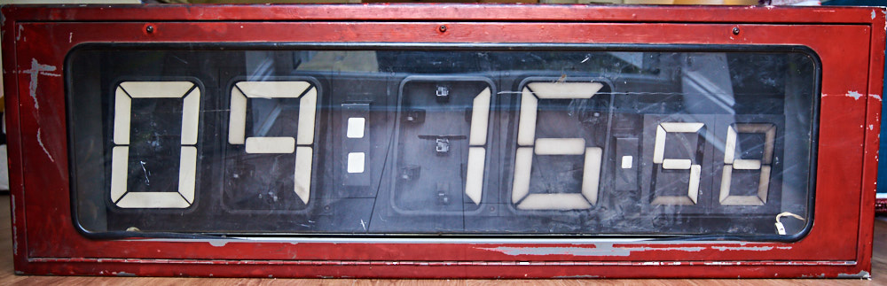
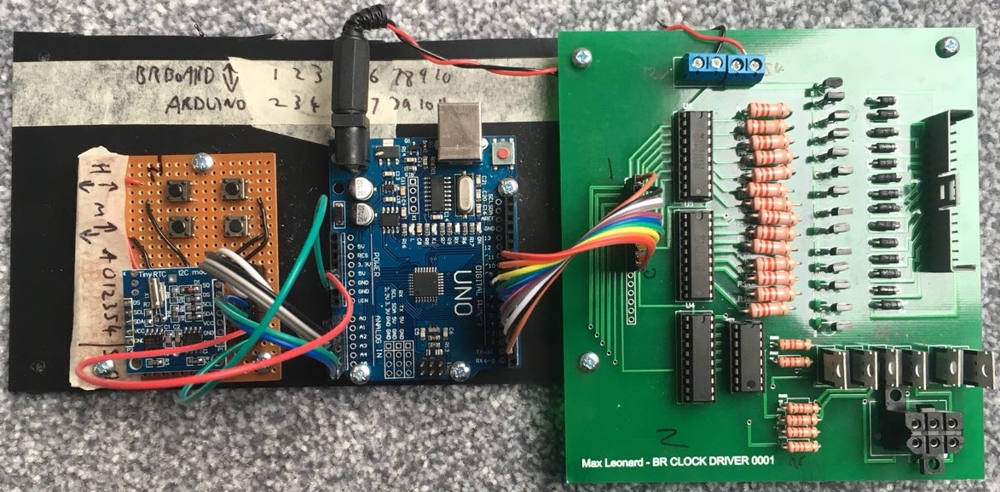

# BRClock

Arduino code to drive a 1980s British Rail station clock and a hardware schematic to match. 

Assuming you want to take an old clock and get it working again, the board in this schematic is a replacement for the main board on a Cartner Engineering British Rail digital clock, similar to the ones used all over the Midlands in the 1980s and 90s. It does not replace the RS-422 interface and generates time from a local oscillator rather than a master clock, which allows it to be run independently. 
 
It expects a 100w 12v supply and a 5w 5v supply. A small PC power supply works well for this. 
You will need to create your own timing and control board, as this isn't included on the main driver board. 
 
 
 

Any questions - please dont hesitate to ask!

 
